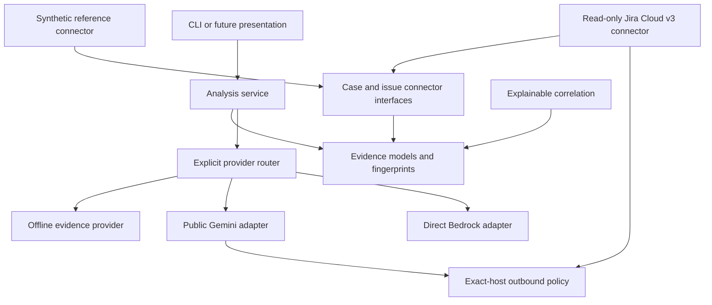

# Architecture

ResolveAtlas v1 is a focused support-intelligence system with explicit boundaries
between external connectors, evidence processing, analysis, and presentation.

## Planned layers

| Layer | Responsibility |
|---|---|
| Web shell | Authentication handoff, navigation, settings, and user-facing workflows |
| Case service | Case retrieval, timeline normalization, attachments, evidence bundles, and RCA drafts |
| Issue service | Jira issue/JQL retrieval, activity normalization, attachments, and analysis |
| Correlation service | Connector-driven related-case and related-issue ranking with explainable reasons |
| Core library | Models, evidence references, fingerprints, cache contracts, jobs, configuration, and errors |
| Connector interfaces | Salesforce, Jira, status evidence, and future support systems |
| AI provider interfaces | Public Gemini and direct AWS Bedrock implementations with task-level routing |
| Runtime | Health, supervision, reverse-proxy examples, logging, and local state boundaries |

## Dependency direction

Presentation depends on domain services. Domain services depend on core
interfaces. Connector and provider implementations depend on public SDKs/APIs
and implement core interfaces. Core code must not import application UIs,
organization-specific schemas, or private adapters.

## Data flow

1. An authenticated user explicitly requests a case or issue workflow.
2. A configured connector retrieves source records and attachments.
3. Deterministic normalization produces evidence objects with source references.
4. Fingerprints and cache policy determine whether prior analysis is reusable.
5. An optional AI task receives a bounded evidence bundle through a configured
   public provider.
6. Structured validation and citation checks run before results are stored or
   displayed.
7. External mutations, if added later, require a separate authorized action and
   are never implied by analysis generation.

## Private adapter boundary

Organization-specific providers, fields, queries, mutation rules, prompts,
deployment targets, and branding are not part of ResolveAtlas. A private adapter
may implement a published interface, but public code must run and test without
that adapter or a private network.

## Implemented vertical slice

The alpha candidate includes immutable evidence models, deterministic
fingerprints, explainable correlation scoring, connector/provider protocols,
an exact-host outbound policy, strict TOML configuration, explicit provider
routing, a synthetic read-only connector, and a deterministic offline provider.
The command-line demonstration exercises this full path without data egress.

The initial external connector is read-only Jira Cloud REST v3. Its deployment
supplies the HTTPS origin, project key, and credential-aware transport; the
connector validates the origin and scopes every key and JQL search to that
project. Attachment ingestion currently accepts bounded UTF-8 text formats
only. Archive, Office, PDF, image, and converter support remain disabled until
their threat-model controls are implemented and tested.
